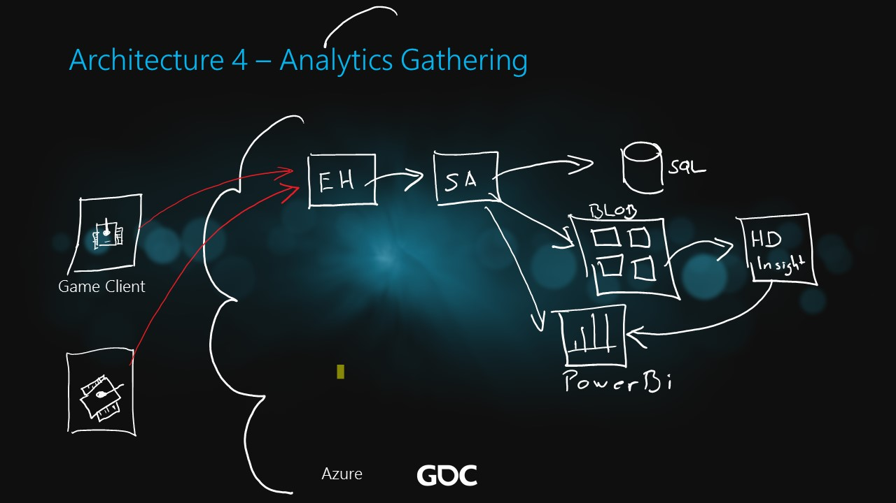

# Analytics Gathering

The ARM template to deploy this architecture in Azure includes the following components:

* Event Hub Namespace
* Stream Analytics Job
* Storage Account
* HDInsights Cluster (Linux, Hadoop)
* SQL Server with one SQL DB
* Power BI embedded

Template asks for a password and uses the same password for all provisioned services. In a production environment this might not be what you want.

| Service                      | User Name | Password                      |
| -----------------------------|-----------|-------------------------------|
| HDInsight Cluster Management | admin     | (As provided to the template) |
| HDInsight SSH Access         | sshuser   | (As provided to the template) |
| SQL database                 | sqluser   | (As provided to the template) |

<a href="https://portal.azure.com/#create/Microsoft.Template/uri/https%3A%2F%2Fraw.githubusercontent.com%2Fdx-ted-emea%2FAzureGamingArchitecture%2Fmaster%2FAnalytics Gathering%2Fazuredeploy.json" target="_blank">    </a>