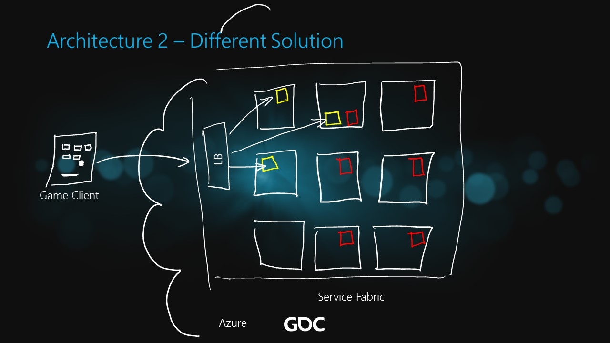

# Different Solution (Service Fabric)

The ARM template to deploy this architecture in Azure includes the following components:

* Virtual Network
* Load Balancer with Public IP
* Service Fabric Cluster

<a href="https://portal.azure.com/#create/Microsoft.Template/uri/https%3A%2F%2Fraw.githubusercontent.com%2Fdx-ted-emea%2FAzureGamingArchitecture%2Fmaster%2FDifferentSolution (ServiceFabric)%2Fazuredeploy.json" target="_blank">    </a>
