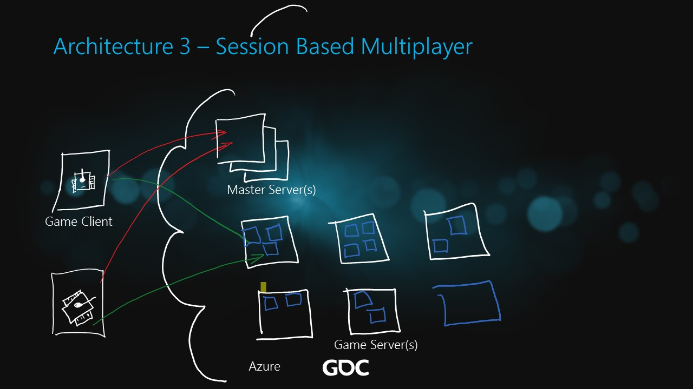

# Session Based Multiplayer

The ARM template to deploy this architecture in Azure includes the following components:

* Virtual Network with two subnets, one subnet dedicated for Master servers and second subnet dedicated for Game servers.
* Virtual Machines Scale Set (VMSS) for Master servers. Base image for VMs is Ubuntu. The load balancer configured with one NAT rule to allow access to SSH for each VM and one Load balancing rule on port 80 to load balance between VMs.
* Virtual Machines Scale Set (VMSS) for Game servers. Base image for VMs is Ubuntu. The load balancer configured with two NAT rules, one NAT rule to allow access to SSH to each VM and second NAT rule on backend port 80 on each VM to allow access to a specific VM.

<a href="https://portal.azure.com/#create/Microsoft.Template/uri/https%3A%2F%2Fraw.githubusercontent.com%2Fdx-ted-emea%2FAzureGamingArchitecture%2Fmaster%2FSessionBasedMultiplayer%2Fazuredeploy.json" target="_blank">    </a><a href="http://armviz.io/#/?load=https%3A%2F%2Fraw.githubusercontent.com%2Fdx-ted-emea%2FAzureGamingArchitecture%2Fmaster%2FSessionBasedMultiplayer%2Fazuredeploy.json" target="_blank">    </a>
