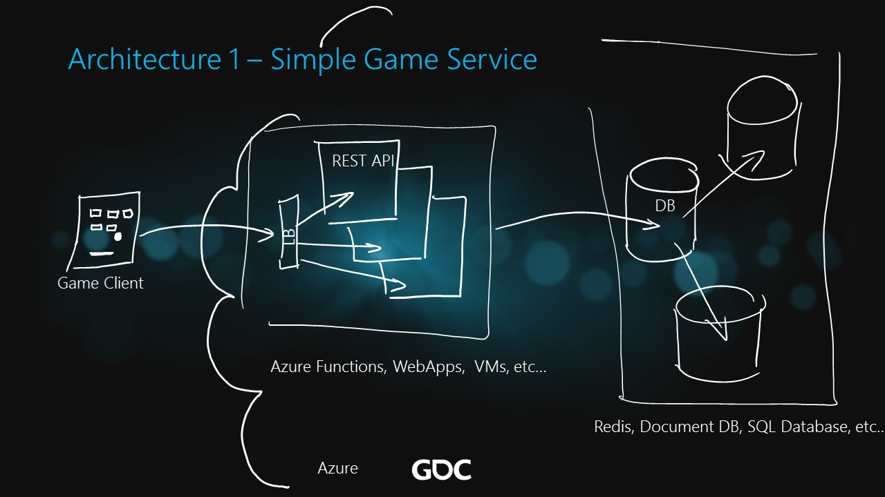

# Simple Game Service

The ARM template to deploy this architecture in Azure includes the following components:

* App Service Plan with one Web APP 
* Application Insights (used by the Web App)
* SQL Server with one SQL DB

